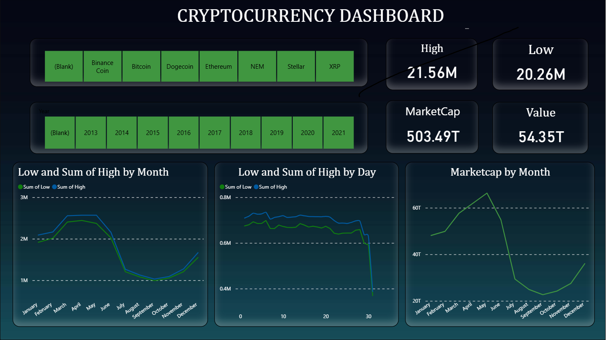

# -CryptoCurrency-Dashboard-


# 📊 Cryptocurrency Dashboard

## 📌 Overview

This project is a **Cryptocurrency Dashboard** built using **Power BI** to analyze and visualize crypto market trends. It provides insights into price movements, market capitalization, and performance across different cryptocurrencies over time.

---

## 🚀 Features

* 📅 **Year-wise Filtering** (2013–2021)
* 💰 **Cryptocurrency Selection** (Bitcoin, Ethereum, Dogecoin, XRP, etc.)
* 📈 **High vs Low Price Analysis**
* 📊 **Market Capitalization Tracking**
* 📉 **Monthly & Daily Trend Analysis**
* 🎯 Interactive and user-friendly dashboard

---

## 📷 Dashboard Preview



---

## 📊 Key Metrics

* **High Price:** 21.56M
* **Low Price:** 20.26M
* **Market Cap:** 503.49T
* **Value:** 54.35T

---

## 📈 Visualizations Included

* **Low vs High Price by Month**
* **Low vs High Price by Day**
* **Market Capitalization by Month**
* Interactive slicers for:

  * Cryptocurrency type
  * Year

---

## 🛠️ Tools & Technologies

* **Power BI**
* Data Visualization Techniques
* Data Cleaning & Transformation

---

## 📂 Project Structure

```
📁 Cryptocurrency Dashboard
 ┣ 📊 Crypto Dashboard.pbix
 ┣ 📷 Dashboard Screenshot.png
 ┗ 📄 README.md
```

---

## 🎯 Purpose

This project is created for:

* Learning **data visualization**
* Understanding **crypto market trends**
* Demonstrating **Power BI dashboard skills**

---

## 🙌 Acknowledgement

Thanks to publicly available cryptocurrency datasets used for analysis and visualization.

---

## 📬 Contact

* 📧 Email: [pavankalyanpatha0107@gmail.com]


